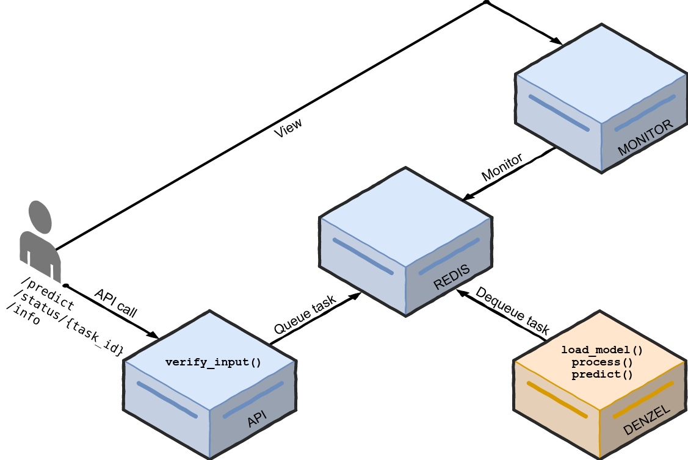
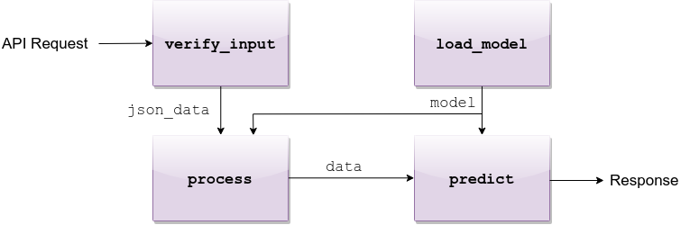

Introduction
============

| Denzel was designed by data scientists for data scientists.
| The framework utilizes production grade tools and practices to allow quick deployment, while abstracting all the mechanics behind the scenes.
| To launch a service with API interface, task queue management and monitoring the only thing required from the data scientist is to fill four functions, and denzel will take care of the rest.
| Those four functions are :func:`pipeline.load_model`, :func:`pipeline.verify_input`, :func:`pipeline.process` and :func:`pipeline.predict` (also called :doc:`pipeline`).

Motivation
++++++++++

| Data scientists are not necessarily software engineers. In most companies' structure the data science team is separated from the other engineering teams.
| In a standard workflow the data science team will get some data and a problem to solve. The team will then iterate until the point where they believe their solution is worthy and will want to test it out in production environment.
| Once this point is reached it is not guaranteed that the engineering teams will have the availability to wrap the solution (model) with a deployment system.
|
| Denzel was created to fill this necessity, to create a framework where a data scientist could deploy a model, in a fast and reliable way.
| Need to deploy? Denzel got your back.

Architecture and Task Flow
++++++++++++++++++++++++++

| Under the hood denzel uses four `docker`_ containers and the system overview is as follows:

    High level overview of the denzel architecture. Each box is a container (API, Redis, denzel and Monitor). In orange is the main container, where the model will reside.
    On top of each container we can see the functions that will need to be implemented by the data scientist

| Each box, is a docker container with its own purpose.
| The API exposes three endpoints to the user, the :ref:`predict_endpoint`, :ref:`status_endpoint` and :ref:`info_endpoint` endpoints.
|
| On system startup (``denzel start``) a worker inside the **denzel container** will use the :func:`pipeline.load_model` function to load the model into memory, and will keep it there until the worker shuts down (should happen only when the system is shut down).
| The worker, is always listening for tasks in the queue, which is inside the **Redis container**.
| When an end-user sends a POST request to the ``/predict`` endpoint, the request will first go through the :func:`pipeline.verify_input` function to make sure the schema is as expected by denzel (defined by the data scientist).
| If all is well, the request is turned into a task and is sent into the task queue.
| As the task enters the queue, if the worker is not already busy it will consume the task. The task then goes through the :func:`pipeline.process` function, which accepts the output of the :func:`pipeline.verify_input` function and parses it to model-ready data.
| If processing is successful, the model-ready data enters the :func:`pipeline.predict` function where all the model magic happens and then a response with the prediction will be sent back to the client in the synchronous case, or to the ``callback_uri`` which was supplied by the end-user initially in the asynchronous case.
| At any time during the lifetime of a task, the end-user can view its status through the :ref:`status_endpoint` endpoint, or through the built-in UI exposed by the **Monitor container**.

.. note::

    By default, denzel will run tasks on parallel, one task per core - for example if the host has 8 cores, that means 8 tasks can be executed in parallel.

    API request flow through the four methods

.. _docker: https://www.docker.com/

.. _tasks_and_synchrony:

Tasks and Synchrony
+++++++++++++++++++

| Denzel separates tasks from predictions jobs. This is so denzel can support batching, where in one task multiple prediction jobs will be sent.
| Consider the following request-body (as JSON) sent by an end-user:

.. code-block:: json

    {
        "callback_uri": "http://alonzo.trainingday.com/stash",  # This could be opted out for synchronous responses
        "data": {"predict_id_1": {"feature1": 0.45, "feature2": -1.99},
                 "predict_id_2": {"feature1": 0.09, "feature2": -6.15}}
    }

| Here we have a task submitted by the user with two separate prediction jobs (which are encapsulated as a single task).
| From here on, there are two possible scenarios; one for synchronous responses and the other for asynchronous.
| By default denzel will return a synchronous response, in which case the end-user will be returned something like:

.. code-block:: json

    {
        "predict_id_1": "hotdog",
        "predict_id_2": "not_hotdog"
    }

| In the synchronous case, that is the end of the case flow.
| While if the asynchronous option is set, as a response, the end-user will be returned:

.. code-block:: json

    {
        "task_id": "1ba0dccre8d67dsa",
        "status": "SUCCESS"
    }

.. note::

    The ``"status": "SUCCESS"`` means the task has been accepted - **not** that there was a prediction made yet.
    Essentially it means the request has passed the :func:`pipeline.verify_input` method and has made it into the queue

| If all goes well, as the end-user sends the request it will **synchronously** get a response with a task ID, uniquely identifying the task submitted.
| After the data has been processed and the prediction has been made, an **asynchronous** response will be sent back to the ``callback_uri`` and will look something like this:

.. code-block:: json

    {
        "predict_id_1": "hotdog",
        "predict_id_2": "not_hotdog"
    }

Why Async Responses?
--------------------

| The use of asynchronous responses is very common in API services.
| Denzel, does not want to limit the data scientist and understands that processing and prediction (espcially of batches) might take longer than the end-user response waiting timeout.
| Using asynchronous responses, the system virtually unlimited in time it takes to return a response, even though it's recommended to respond as fast as possible.
| To use asynchronous responses, use the :ref:`response` command.
