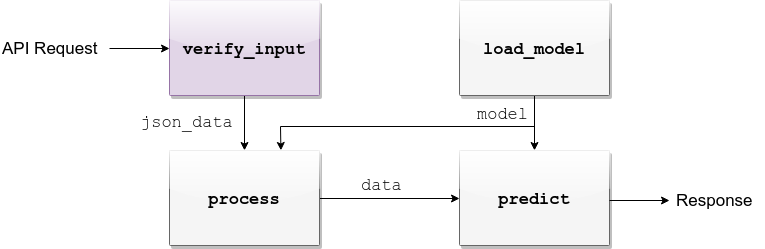
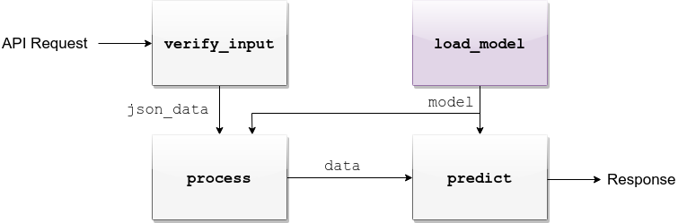
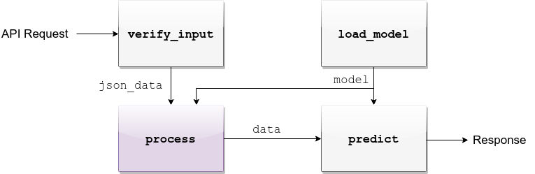
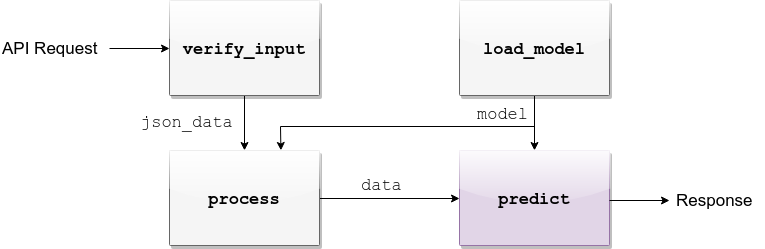
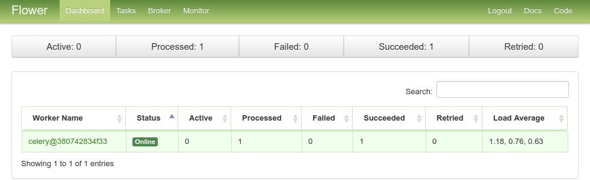

Tutorial
========

| A step by step tutorial for installing and launching a denzel deployment.
| For this tutorial we will train and deploy a Iris classifier, based on the `Iris dataset`_.

Prerequisites
-------------

| Python 3 and docker are necessary for denzel.
| Optionally, you can set up a `virtualenv`_.

1. `Install docker`_, verify its installation by running

    .. code-block:: bash

        $ docker --version
        Docker version 18.09.7, build 2d0083d

2. `Install docker-compose`_ > 1.19.0, verify its installation by running

    .. code-block:: bash

        $ docker-compose --version
        docker-compose version 1.22.0, build f46880fe
        
3. User must be a part of the ``docker`` group (be able to run ``docker`` commands without ``sudo``). Details on how to achieve that can be found in the `official docs`_. 

4. (Optional) `Install virtualenv`_ and create one to work on.

.. note::
    | If opting for ``virtualenv`` understand that the deployment will not be using this env - it will only be used to install denzel on it.
    | The deployment itself will use the interpreter and packages installed into the containers (more on this further down).

.. _`Install docker`: https://docs.docker.com/install/
.. _`Install docker-compose`: https://docs.docker.com/compose/install/
.. _`virtualenv`: https://virtualenv.pypa.io/en/stable/
.. _`Install virtualenv`: https://virtualenv.pypa.io/en/stable/installation/
.. _`official docs`: https://docs.docker.com/install/linux/linux-postinstall/#manage-docker-as-a-non-root-user

.. _`install`:

Installation
------------

| If you are using a virtualenv, make sure you have it active.
| To install denzel, simply run

.. code-block:: bash

    $ pip install denzel

| After this command completes, you should have the ``denzel`` :doc:`cli` available.
| Once available you can always call ``denzel --help`` for the help menu.

.. _toy_model:

Toy Model
---------

| Before actually using denzel, we need a trained model saved locally.
| If you already have one, you can skip this sub-section.
|
| For this tutorial, we are going to use `scikit-learn's default SVM classifier`_ and train it on the `Iris dataset`_.
| The following script downloads the dataset, trains a model and saves it to disk

.. code-block:: python3

    import pandas as pd
    from sklearn.svm import SVC
    from sklearn.model_selection import train_test_split
    import pickle

    # -------- Load data --------
    IRIS_DATA_URL = "https://archive.ics.uci.edu/ml/machine-learning-databases/iris/iris.data"
    IRIS_DATA_COLUMNS = ['sepal-length', 'sepal-width', 'petal-length', 'petal-width', 'class']

    iris_df = pd.read_csv(IRIS_DATA_URL,
                          names=IRIS_DATA_COLUMNS)

    # -------- Spit train and test --------
    features, labels = iris_df.values[:, 0:4], iris_df.values[:, 4]

    test_fraction = 0.2
    train_features, test_features, train_labels, test_labels = train_test_split(
        features, labels,
        test_size=test_fraction)

    # -------- Train and evaluate --------
    model = SVC()
    model.fit(X=train_features, y=train_labels)

    print(model.score(X=test_features, y=test_labels))
    >> 0.9666666666666667

    # -------- Save for later --------
    SAVED_MODEL_PATH = '/home/creasy/saved_models/iris_svc.pkl'
    with open(SAVED_MODEL_PATH, 'wb') as saved_file:
        pickle.dump(
            obj=model,
            file=saved_file)

| Great, we have a model trained to populate the deployment!

.. _`scikit-learn's default SVM classifier`: http://scikit-learn.org/stable/modules/svm.html#svm-classification
.. _`Iris dataset`: https://archive.ics.uci.edu/ml/datasets/Iris

Starting a denzel Project
-------------------------

| To start a project, you first have to run the command :ref:`startproject`, as a result denzel will build for you the following skeleton

.. note::

    | Denzel supports GPU deployments. If you are going to run your deployment on a GPU, make sure you install `nvidia-docker`_ and use the ``--gpu`` flag.

.. code-block:: bash

    $ denzel startproject iris_classifier
    Successfully built iris_classifier project skeleton
    $ cd iris_classifier
    $ tree
    .
    |-- Dockerfile
    |-- __init__.py
    |-- app
    |   |-- __init__.py
    |   |-- assets
    |   |   `-- info.txt  <-------------------------- Deployment information
    |   |-- logic
    |   |   |-- __init__.py
    |   |   `-- pipeline.py  <----------------------- Pipeline Methods
    |   `-- tasks.py
    |-- docker-compose.yml
    |-- entrypoints
    |   |-- api.sh
    |   |-- denzel.sh
    |   `-- monitor.sh
    |-- logs
    |-- requirements.sh  <--------------------------- OS requirements
    `-- requirements.txt  <-------------------------- PIP requirements

| To make denzel fully operational, the only files we'll ever edit are:
| 1. ``requirements.txt`` - Here we'll store all the pip packages our system needs
| 2. ``requirements.sh`` - Here we'll write all the shell commands that are necessary for installations and environment settings e.g ``apt-install``, ``wget`` etc. (if necessary)
| 3. ``app/assets/info.txt`` - Text file that contains deployment information about our model and system
| 4. ``app/logic/pipeline.py`` - Here we will edit the body of the :doc:`pipeline`
|
| These steps, are exactly what this tutorial is all about.

.. tip::

    | A good practice will be to edit only the body of functions in ``pipeline.py`` and if you wish to add your own custom functions that will be called from within ``pipeline.py``, you should put them on a separate file inside the ``app/logic`` directory and import them.

.. _`nvidia-docker`: https://github.com/NVIDIA/nvidia-docker

Requirements
------------

| Requirements can be split into two categories, pip requirements ans OS (operating system) requirements.
| The pip requirements are managed through the ``requirements.txt`` file and the :ref:`updatepipreqs` command, while the OS requirements are managed through the bash script ``requirements.sh`` and the :ref:`updateosreqs` command.

.. tip::

    If you wish to update both requirements (e.g. you've edited both ``requirements.txt`` and ``requirements.sh``), you can call :ref:`updatereqs` to initiate a universal update, where both PIP and OS update will be made.
    This is equivalent to calling :ref:`updatepipreqs` and :ref:`updateosreqs` consecutively, but faster.

^^^^^^^^^^^^^^^^
PIP Requirements
^^^^^^^^^^^^^^^^

| When we've built our toy model, we used ``scikit-learn`` so before anything we want to specify this requirement in the ``requirements.txt`` file.
| Open your favorite file editor, and append ``scikit-learn``, ``numpy`` and ``scipy`` as requirements - don't forget to leave a blank line in the end.
| Your ``requirements.txt`` should look like this

.. code-block:: text

    # ---------------------------------------------------------------
    #                           USER GUIDE
    # Remember this has to be a lightweight service;
    # Keep that in mind when choosing which libraries to use.
    # ---------------------------------------------------------------
    scikit-learn
    numpy
    scipy

| Take heed to the comment at the top of the file. Keep your system as lean as possible using light packages and operations in the pipeline methods.

^^^^^^^^^^^^^^^
OS Requirements
^^^^^^^^^^^^^^^

| Sometimes you might need some OS related installations. Denzel runs on a containerized Ubuntu, so all changes you want to apply to the OS can be done by shell commands on ``requirements.sh``.
| For example you might want to use ``wget`` to fetch some file from the web or ``apt-install`` some dependencies. In many you won't need any alterations to the OS, like in this tutorial, so there is no need to edit the ``requirements.sh`` file.

.. _`api_interface`:

Define Interface (API)
----------------------

| Our end users will need to know what is the JSON scheme our API accepts, so we will have to define what is the accepted JSON scheme for the :ref:`predict_endpoint` endpoint.
| In our :ref:`toy model <toy_model>`, we have four features the model expects: 'sepal-length', 'sepal-width', 'petal-length' and 'petal-width'.
| denzel allows choosing whether your deployed app returns synchronous or asynchronous responses - in this tutorial we will opt for asynchronous responses.
| Since we are going to return an :ref:`async response <tasks_and_synchrony>`, we also need to make sure we include a callback URI in the scheme - remove this field if choosing synchronous.
| Finally we'll want to support batching, so the following JSON scheme should suffice

.. code-block:: json

    {
        "callback_uri": <callback_uri>,  # Opt out if using synchronous responses
        "data": {<unique_id1>: {"sepal-length": <float>,
                                "sepal-width": <float>,
                                "petal-length": <float>,
                                "petal-width": <float>},
                 <unique_id2>: {"sepal-length": <float>,
                                "sepal-width": <float>,
                                "petal-length": <float>,
                                "petal-width": <float>},
                 ...}
    }

| Also let's include a documentation of this interface and the model version in our ``app/assets/info.txt`` file that will be available to the end user in the :ref:`info_endpoint` endpoint.
| For example we might edit ``info.txt`` to something like this

.. parsed-literal::

    # =====================  DEPLOYMENT  ======================

        ██████╗ ███████╗███╗   ██╗███████╗███████╗██╗
        ██╔══██╗██╔════╝████╗  ██║╚══███╔╝██╔════╝██║
        ██║  ██║█████╗  ██╔██╗ ██║  ███╔╝ █████╗  ██║
        ██║  ██║██╔══╝  ██║╚██╗██║ ███╔╝  ██╔══╝  ██║
        ██████╔╝███████╗██║ ╚████║███████╗███████╗███████╗
        ╚═════╝ ╚══════╝╚═╝  ╚═══╝╚══════╝╚══════╝╚══════╝
                             |project_version|

    # ========================  MODEL  ========================

    Model information:
        Version: 1.0.0
        Description: Iris classifier

    For prediction, make a POST request for /predict matching the following scheme

    {
        "callback_uri": "http://alonzo.trainingday.com/stash",
        "data": {<unique_id1>: {"sepal-length": <float>,
                                "sepal-width": <float>,
                                "petal-length": <float>,
                                "petal-width": <float>},
                 <unique_id2>: {"sepal-length": <float>,
                                "sepal-width": <float>,
                                "petal-length": <float>,
                                "petal-width": <float>},
                 ...}
    }

| Looks great, now end users can see this info using GET requests!

Launch (partial project)
------------------------

| In an ideal scenario, we would launch a project only after we have completed all necessary tasks for a full deployment.
| For guidance and simplicity sake of this tutorial, we will launch a partial project and complete tasks gradually.
|
| What we have now is a skeleton, an edited ``info.txt`` and ``requirements.txt`` files and we can launch our API, without the functionality of the :ref:`predict_endpoint` endpoint (yet).
| Inside project directory run:

.. code-block:: bash

    $ denzel launch

    Creating network "iris_classifier_default" with the default driver
    Pulling redis (redis:4)...
    4: Pulling from library/redis
    802b00ed6f79: Pull complete
    8b4a21f633de: Pull complete
    92e244f8ff14: Pull complete
    fbf4770cd9d6: Pull complete
    .
    .

.. note::

    By default denzel will occupy port 8000 for the API and port 5555 for monitoring. If one of them is taken, denzel will let you know and you can opt for other ports - for more info check the :ref:`launch` command documentation.

| If this is the first time you launch a denzel project, the necessary docker images will be downloaded and built.
| What is going on in the background is necessary for building the containers that will power the deployment.
|
| If you are not really familiar with docker you can think of images like classes in programming, they define the structure of an object, and containers are like the instances.
| In the context of docker the objects the images define are actually virtual machines and the containers we create from them is where our code will run on.
|
| This whole process might take a few minutes, so sit back and enjoy an `Oscar winning performance by the man himself`_.

.. _`Oscar winning performance by the man himself`: https://youtu.be/6KrNpxODiDA

| Once done if everything went right you should see the end of the output looking like this:

.. code-block:: bash

    Starting redis   ... done
    Starting api     ... done
    Starting denzel  ... done
    Starting monitor ... done

| This indicates that all the containers (services) were created and are up.
| Once they are up the services will start installing the packages we specified in ``requirements.txt``, you can view the status of the services by using the :ref:`status` command, optionally with the ``--live`` flag.
| If you would run it right away you'd expect to see:

.. code-block:: bash

    $ denzel status
    Services:
        denzel - PIP INSTALLING...
        monitor - PIP INSTALLING...
        api - PIP INSTALLING...
        redis - UP

| When all the installing is done and everything is ready, you'll see all the statuses change to ``UP`` with an additional line ``Worker: worker@iris_classifier - UP`` indicating the worker is ready.
| If you want to see the messages printed out throughout the installation, you can use the :ref:`logs` command.
| At any time during the lifetime of your project, if you want to add more pip packages, just insert them to the ``requirements.txt`` file and use the :ref:`updatepipreqs` command.

.. tip::

    | Using the ``denzel status --live`` command is a great way to monitor the system. When conducting installations and loading it is a great way to get a high level live view of the system.
    | For lower level view, examining the outputs of the containers, use the live view of the logs using ``denzel logs --live``.

| For sanity check, assuming you have deployed locally, open your favorite browser and go to http://localhost:8000/info . You should see the contents of ``info.txt`` (assuming all services are up).
| At any time, you can stop all services using the :ref:`stop` command and start them again with the :ref:`start` command.
| From this moment forward we shouldn't use the :ref:`launch` command as a project can and needs to be launched once.
| If for any reason you wish to relaunch a project (for changing ports for example) you'd have to first :ref:`shutdown` and then :ref:`launch` again.

Opt for Asynchronicity (optional)
---------------------------------

| In this tutorial, we will use asynchronous responses.
| If you skip this step and keep following the tutorial you will get the exact same result but with synchronous responses.
| To enable asynchronous responses, use the :ref:`response` command line call. There is **no** need to restart when changing the response manner.

.. code-block:: bash

    $ denzel response --async

.. tip::

    | You can always go back to synchronous responses, for example for synchronous responses with 5 seconds timeout, call ``denzel response --sync --timeout 5.0``.

| Now denzel will make sure responses are returned back to the ``callback_uri``.

Pipeline Methods
----------------

| Now is the time to fill the body of the :doc:`pipeline methods <pipeline>`. They are all stored inside ``app/logic/pipeline.py``.
| Open this file in your favorite IDE as we will go through the implementation of these methods.

^^^^^^^^^^^^^^^^
``verify_input``
^^^^^^^^^^^^^^^^

| When a user makes a request, the first pipeline method that the request will meet is :ref:`pipeline_verify_input`.
| The :ref:`pipeline_verify_input` method is responsible for making sure the JSON data received matches the :ref:`interface we defined <api_interface>`.
| In order to do that, lets edit the :ref:`pipeline_verify_input` method to do just that:

.. code-block:: python3

    FEATURES = ['sepal-length', 'sepal-width', 'petal-length', 'petal-width']

    def verify_input(json_data):
        """
        Verifies the validity of an API request content

        :param json_data: Parsed JSON accepted from API call
        :type json_data: dict
        :return: Data for the the process function
        """

        # callback_uri is needed to sent the responses to, DELETE this if block for synchronous responses
        if 'callback_uri' not in json_data:
            raise ValueError('callback_uri not supplied')

        # Verify data was sent
        if 'data' not in json_data:
            raise ValueError('no data to predict for!')

        # Verify data structure
        if not isinstance(json_data['data'], dict):
            raise ValueError('json_data["data"] must be a mapping between unique id and features')

        # Verify data scheme
        for unique_id, features in json_data['data'].items():
            feature_names = features.keys()
            feature_values = features.values()

            # Verify all features needed were sent
            if not all([feature in feature_names for feature in FEATURES]):
                raise ValueError('For each example all of the features [{}] must be present'.format(FEATURES))

            # Verify all features that were sent are floats
            if not all([isinstance(value, float) for value in feature_values]):
                raise ValueError('All feature values must be floats')

        return json_data

| In the verification process implementation, you may throw any object that inherits from ``Exception`` and the message attached to it will be sent back to the user in case he tackles that exception.

.. tip::

    For JSON scheme verification, you can consider using the `jsonschema`_ library.

    .. _`jsonschema`: https://github.com/Julian/jsonschema

^^^^^^^^^^^^^^
``load_model``
^^^^^^^^^^^^^^

| :ref:`pipeline_load_model` is the method responsible for loading our saved model into memory and will keep it there as long as the worker lives.
| This method is called when denzel starts up and is called only once - unlike :ref:`pipeline_verify_input`, :ref:`pipeline_process` and :ref:`pipeline_predict` which are called one time per request.
| So our model will be accessible for reading, we must copy it into the project directory, preferably to ``app/assets``. Once copied there, the assets directory should be as follows:

.. code-block:: bash

    $ cd app/assets/
    $ ls -l

    total 8
    -rw-rw-r-- 1 creasy creasy 1623 Sep 14 14:35 info.txt
    -rw-rw-r-- 1 creasy creasy 3552 Sep 14 08:55 iris_svc.pkl

| Now if we'll look at ``app/logic/pipeline.py`` we will find the skeleton of :ref:`pipeline_load_model`.
| Edit it so it loads the model and returns it, it should look something like:

.. code-block:: python3

    import pickle

    .
    .

    def load_model():
        """
        Load model and its assets to memory
        :return: Model, will be used by the predict and process functions
        """
        with open('./app/assets/iris_svc.pkl', 'rb') as model_file:
            loaded_model = pickle.load(model_file)

        return loaded_model

.. note::

    | When using paths on code which is executed inside the containers (like the pipeline methods) the current directory is always the project main directory (where the ``requirements.txt`` is stored). Hence the saved model prefix above is ``./app/assets/...``.

| When we edit the pipeline methods, the changes do not take effect until we restart the services.
| As we just edited a pipeline method, we should run the :ref:`restart` command so the changes apply.
| Navigate back into the project main directory and run ``denzel restart`` and after the services have restarted the changes will take effect.
| To verify all went well you can examine the logs by running the :ref:`logs` command - if anything went wrong we will see it there (more about that in :ref:`debugging`).

.. warning::

    | When loading heavy models (unlike the tutorial classifier) that take long time to be read, you might want to wait for it to load before making any requests.
    | To do that, you should watch the output of the :ref:`status` command and check if your worker is ready, optionally with the ``--live`` flag. If your model is indeed taking much time to load, the output should like like follows:

    .. code-block:: bash

        $ denzel status

        Services:
            denzel - UP
            monitor - UP
            api - UP
            redis - UP
        Worker: all - LOADING...

    | This means all the services are up, but API endpoints (as well as monitoring) are not available yet as the worker is still loading.

^^^^^^^^^^^
``process``
^^^^^^^^^^^

| The output of the :ref:`pipeline_verify_input` and :ref:`pipeline_load_model` methods are the input to the :ref:`pipeline_process` method.
| The model object itself is not always necessary, but it is there if you want to have some kind of loaded resource available for the processing, in this tutorial we won't use the model in this method.
|
| Now we are in possession of the JSON data, and we are already sure it has all the necessary data for making predictions.
| Our model though, does not accept JSON, it expects four floats as input, so in this method we will turn the JSON data into model-ready data.
| For our use case, we should edit the function to look as follows:

.. code-block:: python3

    .
    .
    import numpy as np
    .
    .

    def process(model, json_data):
        """
        Process the json_data passed from verify_input to model ready data

        :param model: Loaded object from load_model function
        :param json_data: Data from the verify_input function
        :return: Model ready data
        """

        # Gather unique IDs
        ids = json_data['data'].keys()

        # Gather feature values and make sure they are in the right order
        data = []
        for features in json_data['data'].values():
            data.append([features[FEATURES[0]], features[FEATURES[1]], features[FEATURES[2]], features[FEATURES[3]]])

        data = np.array(data)
        """
        data = [[float, float, float, float],
                [float, float, float, float]]
        """

        return ids, data

^^^^^^^^^^^
``predict``
^^^^^^^^^^^

| The output of :ref:`pipeline_process` and :ref:`pipeline_load_model` are the input to the :ref:`pipeline_predict` method.
| The final part of a request lifecycle is the actual prediction that will be sent back as response.
| In our example in order to do that we would edit the method to look as follows:

.. code-block:: python3

    def predict(model, data):
        """
        Predicts and prepares the answer for the API-caller

        :param model: Loaded object from load_model function
        :param data: Data from process function
        :return: Response to API-caller
        :rtype: dict
        """

        # Unpack the outputs of process function
        ids, data = data

        # Predict
        predictions = model.predict(data)

        # Pack the IDs supplied by the end user and their corresponding predictions in a dictionary
        response = dict(zip(ids, predictions))

        return response

.. warning::

    The returned value of the :ref:`pipeline_predict` function must be a **dictionary and all of its contents must be JSON serializable**.
    This is necessary because denzel will parse it into JSON to be sent back to the end user.

| And... That's it! Denzel is ready to be fully operational.
| Don't forget, after all these changes we must run ``denzel restart`` so they will take effect.
| For reference, the full ``pipeline.py`` file should look like this

.. code-block:: python3

    import pickle
    import numpy as np

    FEATURES = ['sepal-length', 'sepal-width', 'petal-length', 'petal-width']

    # -------- Handled by api container --------
    def verify_input(json_data):
        """
        Verifies the validity of an API request content

        :param json_data: Parsed JSON accepted from API call
        :type json_data: dict
        :return: Data for the the process function
        """

        # callback_uri is needed to sent the responses to, DELETE this if block for synchronous responses
        if 'callback_uri' not in json_data:
            raise ValueError('callback_uri not supplied')

        # Verify data was sent
        if 'data' not in json_data:
            raise ValueError('no data to predict for!')

        # Verify data structure
        if not isinstance(json_data['data'], dict):
            raise ValueError('json_data["data"] must be a mapping between unique id and features')

        # Verify data scheme
        for unique_id, features in json_data['data'].items():
            feature_names = features.keys()
            feature_values = features.values()

            # Verify all features needed were sent
            if not all([feature in feature_names for feature in FEATURES]):
                raise ValueError('For each example all of the features [{}] must be present'.format(FEATURES))

            # Verify all features that were sent are floats
            if not all([isinstance(value, float) for value in feature_values]):
                raise ValueError('All feature values must be floats')

        return json_data

    # -------- Handled by denzel container --------
    def load_model():
        """
        Load model and its assets to memory

        :return: Model, will be used by the predict and process functions
        """
        with open('./app/assets/iris_svc.pkl', 'rb') as model_file:
            loaded_model = pickle.load(model_file)

        return loaded_model

    def process(model, json_data):
        """
        Process the json_data passed from verify_input to model ready data

        :param model: Loaded object from load_model function
        :param json_data: Data from the verify_input function
        :return: Model ready data
        """

        # Gather unique IDs
        ids = json_data['data'].keys()

        # Gather feature values and make sure they are in the right order
        data = []
        for features in json_data['data'].values():
            data.append([features[FEATURES[0]], features[FEATURES[1]], features[FEATURES[2]], features[FEATURES[3]]])

        data = np.array(data)

        return ids, data

    def predict(model, data):
        """
        Predicts and prepares the answer for the API-caller

        :param model: Loaded object from load_model function
        :param data: Data from process function
        :return: Response to API-caller
        :rtype: dict
        """

        # Unpack the outputs of process function
        ids, data = data

        # Predict
        predictions = model.predict(data)

        # Pack the IDs supplied by the end user and their corresponding predictions in a dictionary
        response = dict(zip(ids, predictions))

        return response

Using the API to Predict
------------------------

| Now is the time to put denzel into action.
| Since we opted for asynchronous responses, we must first have some URI to receive the responses (you can skip the callback URI part if using synchronous responses).
| You can do that by using `waithook`_ which is an in browser service for receiving HTTP requests, just what we need - just follow the link, choose a "Path Prefix" (for example ``john_q``) and press "Subscribe".
| Use the link that will be generated for you (http://waithook.com/<chosen_path_prefix>) and keep the browser open as we will receive the responses to the output window.
| Next we need to make an actual POST request to the :ref:`predict_endpoint` endpoint. We will do that using `curl`_ through the command line.

.. tip::
    | There are more intuitive ways to create HTTP requests than `curl`_. For creating requests through UI you can either use `Postman`_, or through Python using the `requests`_ package.

| Let's launch a predict request, for two examples from the test set:

.. tabs::

    .. code-tab:: bash

        $ curl --header "Content-Type: application/json" \
        > --request POST \
        > --data '{"callback_uri": "http://waithook.com/john_q",'\
        > '"data": {"a123": {"sepal-length": 4.6, "sepal-width": 3.6, "petal-length": 1.0, "petal-width": 0.2},'\
        > '"b456": {"sepal-length": 6.5, "sepal-width": 3.2, "petal-length": 5.1, "petal-width": 2.0}}}' \
        http://localhost:8000/predict

    .. code-tab:: python

        import requests

        data = {
          "callback_uri": "http://waithook.com/john_q",
          "data": {"a123": {"sepal-length": 4.6, "sepal-width": 3.6, "petal-length": 1.0, "petal-width": 0.2},
                   "b456": {"sepal-length": 6.5, "sepal-width": 3.2, "petal-length": 5.1, "petal-width": 2.0}}
        }

        response = requests.post('http://localhost:8000/predict', json=data)

| If the request has passed the :ref:`pipeline_verify_input` method, depending on which response manner you chose (sync/async) there are two possible scenarios.
| On the synchronous scenario, you would simply get the predictions and this is where the flow ends.
| On the asynchronous scenario, you should immediately get a response that looks something like (on curl, you'd see it in your prompt, with ``requests`` you'll have it in ``response.json()``):

.. code-block:: json

    {"status":"success","data":{"task_id":"19e39afe-0729-43a8-b4c5-6a60281157bc"}}

| This means that the task has passed verification successfully, already entered the task queue and will next go through :ref:`pipeline_process` and :ref:`pipeline_predict`.
| At any time, you can view the task status by sending a GET request to the :ref:`status_endpoint` endpoint.
| If you examine waithook in your browser, you will see that a response was already sent back with the prediction, it should looks something like:

.. code-block:: json

    {
      "method": "POST",
      "url": "/john_q",
      "headers": {
        "User-Agent": "python-requests/2.19.1",
        "Connection": "close",
        "X-Forwarded-Proto": "http",
        "Accept": "*/*",
        "Accept-Encoding": "gzip, deflate",
        "Content-Length": "49",
        "Content-Type": "application/json",
        "Host": "waithook.com",
        "X-Forwarded-for": "89.139.202.80"
      },
      "body": "{\"a123\": \"Iris-setosa\", \"b456\": \"Iris-virginica\"}"
    }

| In the ``"body"`` section, you can see the returned predictions.
| If you got this response it means that all went well and your deployment is fully ready.

.. _`waithook`: http://waithook.com/
.. _`curl`: https://curl.haxx.se/docs/manual.html
.. _`Postman`: https://www.getpostman.com/
.. _`requests`: http://docs.python-requests.org/en/master/

Monitoring
----------

| Denzel comes with a built in UI for monitoring the tasks and workers.
| To use it, once the system is up go to the monitor port (defaults to 5555) on the deployment domain. If deployed locally open your browser and go to http://localhost:5555
| You will be presented with a UI that looks something like:

    Example of Flower's monitoring UI

| This dashboard is generated by `Flower`_, and gives you access to examine the worker status, tasks status, tasks time and more.

.. _`Flower`: https://flower.readthedocs.io/en/latest/

.. _debugging:

Debugging
---------

| Life is not all tutorials and sometime things go wrong.
| Debugging exceptions is dependent of where the exception is originated at.

^^^^^^^^^^^^^^^^^^^^^^^^^^^
``verify_input`` Exceptions
^^^^^^^^^^^^^^^^^^^^^^^^^^^

| This method is executed in the API container. If anything goes wrong in this method you will get it as an immediate response to your ``/predict`` POST request.
| For example, lets say we make the same POST request as we did before, but we opt out one of the features in the data.
| Given the code we supplied ``verify_input`` we should get the following response

.. code-block:: json

    {
     "title": "Bad input format",
     "description": "For each example all of the features [['sepal-length', 'sepal-width', 'petal-length', 'petal-width']] must be present"
    }

^^^^^^^^^^^^^^^^^^^^^^^^^
``load_model`` Exceptions
^^^^^^^^^^^^^^^^^^^^^^^^^

| If anything went wrong with the :ref:`pipeline_load_model` method, you will only able to see the traceback and exception on the logs.
| Specifically, the denzel service log is where the model is loaded. In this case the exception can be found through the :ref:`logs` (to isoltate the relevant container, pass the ``--service denzel`` option) or :ref:`logworker` command.
| Check them both as the location of the exception is dependent on its type.

^^^^^^^^^^^^^^^^^^^^^^^^^^^^^^^^^^^^
``process`` & ``predict`` Exceptions
^^^^^^^^^^^^^^^^^^^^^^^^^^^^^^^^^^^^

| If something went wrong in these methods, it necessarily means you made a successful request and passed the :ref:`pipeline_verify_input` method and have received a ``"SUCCESS"`` status to your response with a task ID.
| :ref:`pipeline_process` and :ref:`pipeline_predict` both get executed on the denzel container. If anything goes wrong inside of them it will be most likely only visible when querying for task status.
| For example, if we would forget to import ``numpy as np`` even though it is in use in the :ref:`pipeline_process` method - we will get a ``"SUCCESS"`` response for our POST (because we passed the :ref:`pipeline_verify_input` method).
| But the task will fail after entering the :ref:`pipeline_process` method - to see the reason, we should query the :ref:`status_endpoint` and we would see the following:

.. code-block:: json

    {
     "status": "FAILURE",
     "result": {"args":["name 'np' is not defined"]}
    }

Deployment
----------

| Since denzel is fully containerized it should work on any machine as long as it has docker, docker-compose and Python3 installed.
| Also all of the main cloud service providers already support dockerized appications.
|
| After completing all the necessary implementations for deployment covered in this tutorial it is best to check that the system can be launched from scratch.
| To do that, we should :ref:`shutdown` while purging all images, and relaunch the project - don't worry no code is being deleted during shutdown. This process it to make sure that when we deploy it somewhere else, it will work.
| Go to the main project directory and run the following:

.. code-block:: bash

    $ denzel shutdown --purge

    Stopping iris_classifier_denzel_1  ... done
    Stopping iris_classifier_monitor_1 ... done
    Stopping iris_classifier_api_1     ... done
    Stopping iris_classifier_redis_1   ... done
    Removing iris_classifier_denzel_1  ... done
    Removing iris_classifier_monitor_1 ... done
    Removing iris_classifier_api_1     ... done
    Removing iris_classifier_redis_1   ... done
    Removing network iris_classifier_default
    Removing image redis:4
    Removing image denzel:1.0.0
    Removing image denzel:1.0.0
    ERROR: Failed to remove image for service denzel:1.0.0: 404 Client Error: Not Found ("No such image: denzel:1.0.0")
    Removing image denzel
    ERROR: Failed to remove image for service denzel:1.0.0: 404 Client Error: Not Found ("No such image: denzel:1.0.0")

    $ denzel launch
    Creating network "iris_classifier_default" with the default driver
    Pulling redis (redis:4)...
    4: Pulling from library/redis
    .
    .

.. note::

    | The "ERROR: Failed to remove...." can be safely ignored. This is a result of the ``--purge`` flag that tells denzel to remove the denzel image.
    | Since the image is used by three different containers, it will successfully delete it on the first container but fail on the other two.

| After the relaunching is done check again that all endpoints are functioning as expected - just to make sure.
| If all is well your system is ready to be deployed wherever, on a local machine, a remote server or a docker supporting cloud service.
| To deploy it elsewhere simply copy all the contents of the project directory to the desired destination, verify docker, docker-compose and Python3 are installed, :ref:`install denzel <install>` and call ``denzel launch`` from within that directory.
| As a matter of fact, we can skip the installing denzel part when we deploy - more about that in the :ref:`production` section.

.. _`production`:

Production
----------

| Denzel is essentially a docker-compose application, with an accompanying CLI tool to abstract docker and OS related functionality from the data scientist developing the application.
| This means that if you are going to deploy your application on a docker-supporting cloud service, or deliver it to a production developer the denzel package is no longer mandatory.
| Because the contents of the project directory already include the ``docker-compose.yml``, the ``Dockerfile`` and all the code needed to run and manage the application - Any service or person that can deal with docker will be able to do so.
| Denzel is built that way so that going into production, more advanced docker management tools (like `Kubernetes`_) can be used to apply more advanced production techniques like continuous deployment and scaling.
|
| Denzel takes you from a model, to a containerized and deployable application in a data scientist oriented way - once you have that, the options are endless.

.. _`Kubernetes`: https://kubernetes.io/

Deleting
--------

| Deleting a denzel project is very simple.
| To do so we must call the :ref:`shutdown` command, to remove all of the containers. Optionally we could pass the ``--purge`` flag to remove the underlying images.
| Then delete the project directory and the denzel project is fully removed.
